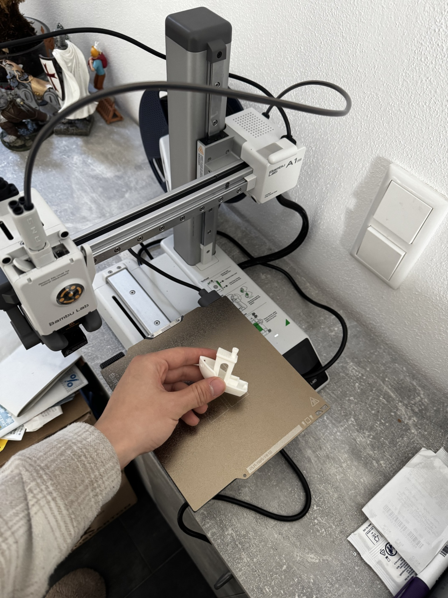
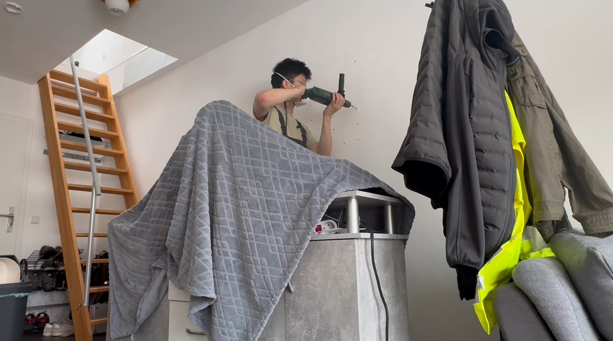
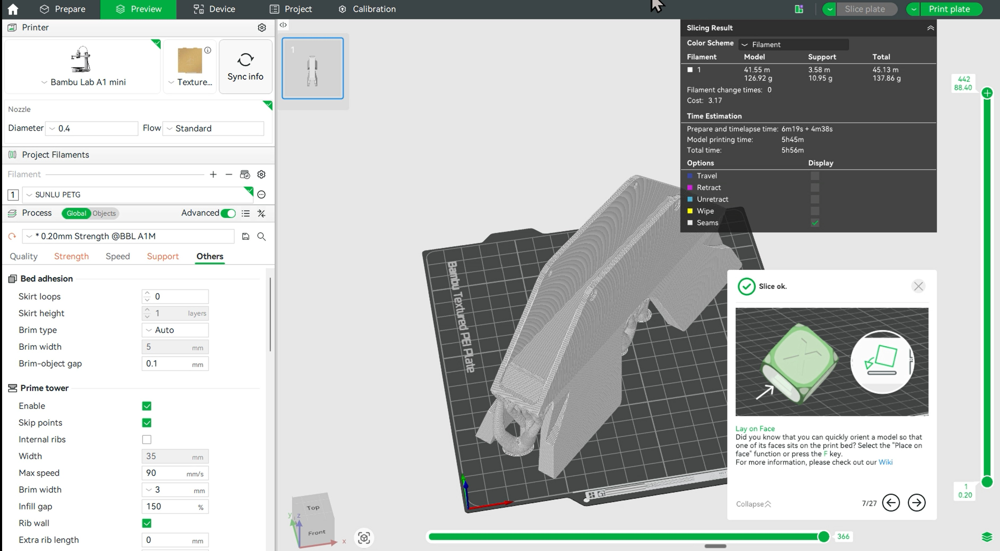
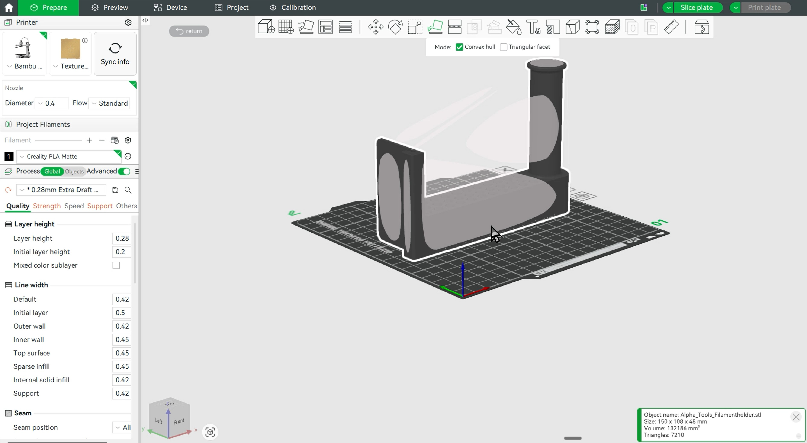
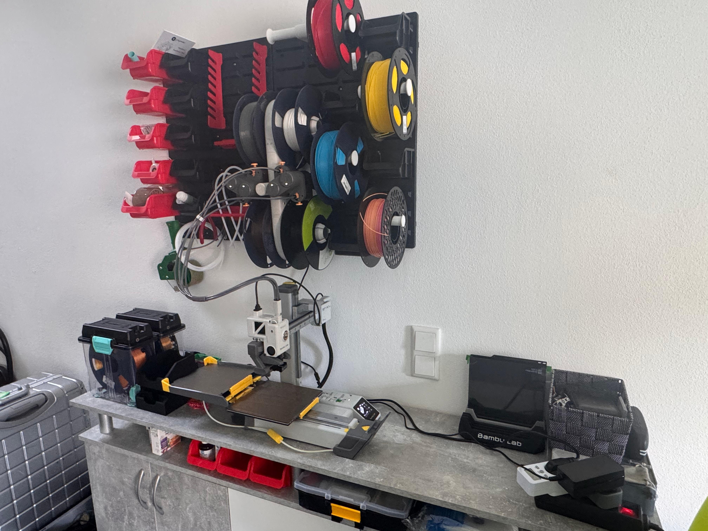
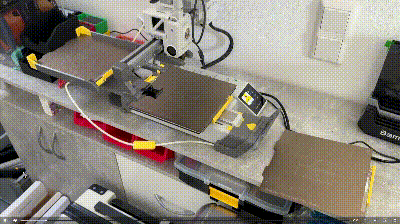

# Upgrading my Bambu Lab A1 mini 3D-Printer
## Introduction of this project
### The Old State
The [A1 mini](https://bambulab.com/en/a1-mini) has been purchased for around half a year and could only do some single color painting. I would like to explore its greater value. 

### Following points were to upgrade:
1. The [AMS-Lite](https://eu.store.bambulab.com/products/ams-lite?srsltid=AfmBOopbtWHE84Upa1htHpR5YwgX7E2Tm4HQtCmIZ4THBOAI-7te9rej) automatic material system for A1 mini, which enables switching between spools when printing.
2. The [Swapmod-system](https://swap-systems.com/product/swapmod-kit/) from [Swap-Systems](https://swap-systems.com/), which enables the remote switching of printing plates. That way, I could start multiple printing tasks remotely, even I am not at home.
3. I would also need some extra space for storing all the small tools and gadgets. For this, my plan is to build a pegboard above my printer, something like the very famous [SKÅDIS Pegboard](https://www.ikea.com/us/en/p/skadis-pegboard-white-10321618/) from [IKEA](https://www.ikea.com/us/en/) 
## Building Steps
1. Firstly, I tested the AMS-Lite system, which didn't take up much time and effort. 
2. I realised there was no enough space for the swap mod, if I keep the AMS-Lite on table. Thus it needs to be moved to the wall.
	1. As the board is to carry a heavy burden, first drill an array of holes in the wall and drive in expansion bolts. 
	2. The board is then installed with some small storage boxes already mounted. 
	3. To move the AMS-Lite onto the wall, I need a firm mounting for it. I used [Autodesk Fusion 360](https://www.autodesk.com/products/fusion-360/overview) for the CAD-Designing and printed them out with PETG material. 
	4. The rest of the space shall not be wasted. I also designed spool holders for holding some reserve spools. 
	5. And it is beautifully arranged and has made some space for the rest.
3. The last step is to install the swap-mod. With the extra space I've won for it, it went pretty quick.  
## Final Results
Now let's take a moment to enjoy this plate-swapping process:
