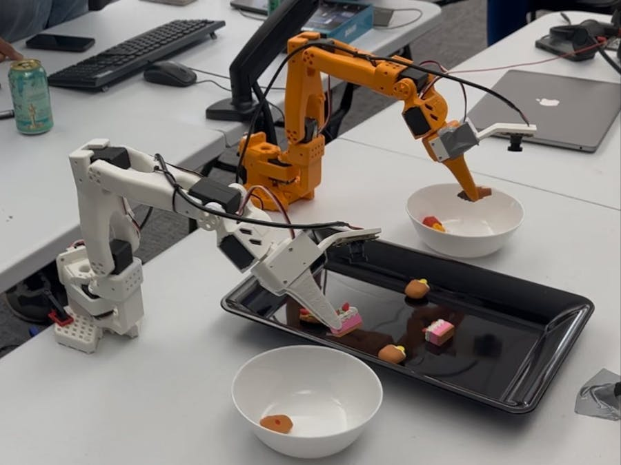
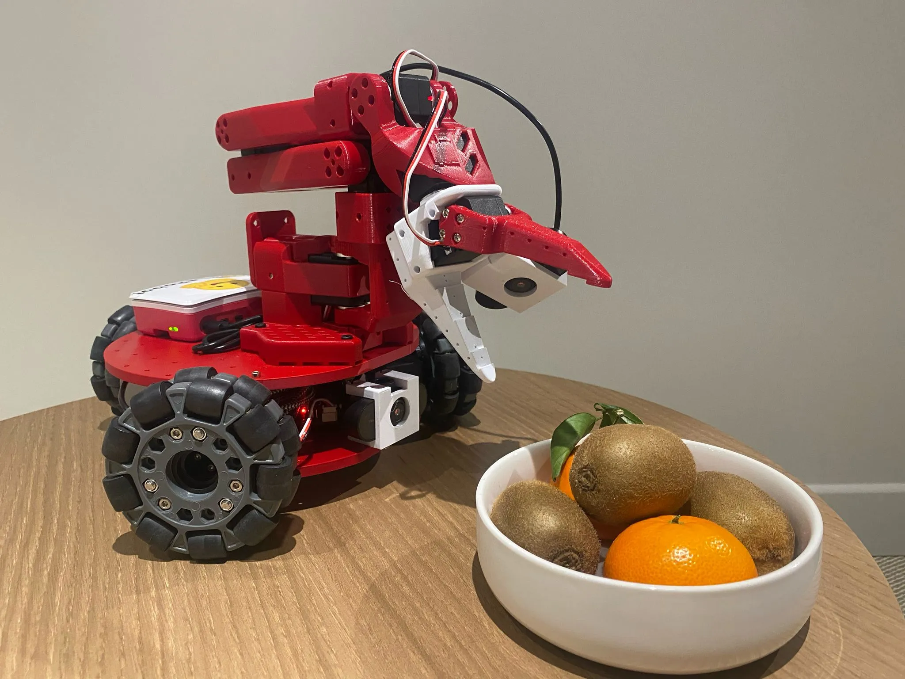
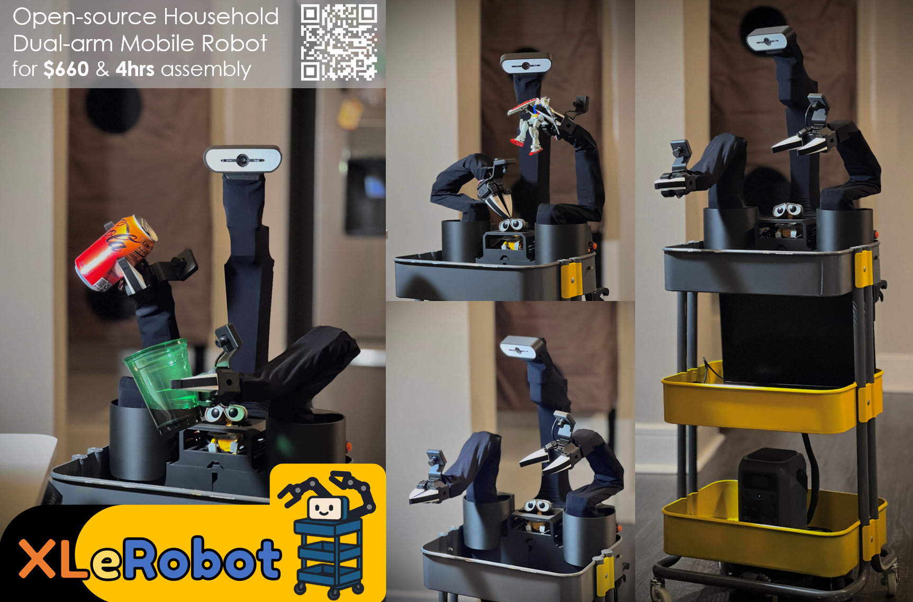
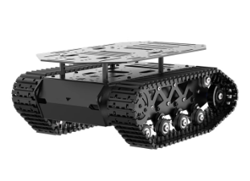
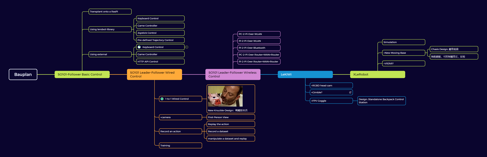

# Project: Domestic Robots - LeRobot

## Overview of this Project

### Motivation

- **Since last year, the robotics industry has been booming,** with significant advancements in AI and machine learning. New concepts and prototypes are emerging rapidly, making it an exciting time to explore this field. 

- **The life for a single person can be quite busy,** it's really frustrating to come home after a long day and still have to do chores like cleaning, cooking, and laundry.

- **My current job is flexible, but lacking innovation.** I want to work on something that challenges me and allows me to learn new skills. I am approaching my 30s, and I don't want to end up a day in my 80s, with the same working routine, which is happening to many people in my family. **I know that we are undergoing another industrial revolution, and I want to be part of it.**

Well then, why not give it a try?

### Introduction to the open-source projects

1. [LeRobot](https://github.com/huggingface/lerobot) - aims to provide models, datasets, and tools for real-world robotics in PyTorch. The goal is to lower the barrier to entry to robotics so that everyone can contribute and benefit from sharing datasets and pretrained models.

    

2. [XLeRobot](https://github.com/Vector-Wangel/XLeRobot): Accidentally I came across this project that's called XLeRobot and was at once fascinated by it. It combines several existing LeRobot projects, such as the [SO101-Robot arm](https://huggingface.co/docs/lerobot/en/so101) and the [LeKiWi](https://huggingface.co/docs/lerobot/lekiwi) moving base, with an [IKEA RÅSKOG Trolley](https://www.ikea.com/us/en/p/raskog-trolley-black-90449924/) to create a mobile robot platform that can navigate and manipulate objects in a domestic environment. I sent immediately a direct message to the author of the project, [@VectorWang](https://github.com/Vector-Wangel). He answered me very kindly and we found out even some mutual friends. I didn't hesitate, but ordered the IKEA trolley and started to collect all the necessary parts.

    
    *The LeKiWi trying to catch a Kiwi.*

    

## Plan for the Project

### How should it look like?
- As the first step, I would follow up the tutorials and replicate the robot in my home environment. 

- A very obvious problem in the current design is that the moving base, which is driven by 3 omni-wheels and designed for a single robot arm, provides too little momentum and ground clearance, which constrains the robot's ability to move around in a typical home environment. Therefore, I would like to replace the moving base with a more robust one, such as a tracked base or a four-wheel drive base.

    A possible solution would be this Chasis from Taobao: 
    

### What should it be able to do?

1. Movability: The robot should be able to navigate around the house, avoiding obstacles and reaching designated locations.
2. Remote Control/Teleoperation: The robot base should be controllable via a joypad or a mobile app. The 2 robot arms should be controllable via the 2 corresponding followers. One future development could be a standalone backpack remote control unit, which contains an IMU in detecting the movement and 2 leader arms in controlling the robot arms. These movements would be transmitted to the robot via WiFi or Bluetooth, or even throgh WAN-based communication.
3. Detection: When not being remotely controlled, the robot should be able to recognize and locate objects in its environment using computer vision. Currently available: 2 cameras on the end-effectors, 1 camera on the moving base, and possibly an additional depth camera.
4. Manipulation through VLA (Vision-Language-Action) models: The robot should be able to perform simple tasks such as picking up objects, opening doors, and pressing buttons based on natural language commands. This would require the integration of VLA models that can understand and execute instructions.

### How am I going to achieve everything? (Timeline)

Here is a timeline I have in mind:

Skills and knowledge I would need to acquire:
- Robotics: Kinematics, Dynamics, Control Systems
- Computer Vision: Object Detection, Image Processing
- Machine Learning: VLA Models, Reinforcement Learning
- Hardware: RGB-D Camera, Raspberry Pi, Motor Controllers, Optional: Jetson Nano
- Software: ROS, Python, PyTorch, OpenCV

## Set-ups and Configurations

### First Procurement

The first procurement has been done on 2024-06-25 according to the [Bill of Materials](https://xlerobot.readthedocs.io/en/latest/hardware/getting_started/material.html).

### Software Installation
1. I have installed dual boot Windows 11 and Ubuntu 24.04 on my laptop, following the instructions from [here](https://itsfoss.com/install-ubuntu-alongside-windows/).
2. For CAD design, I have installed Fusion 360, Shapr3D.
3. For programming, I have installed VS Code, Anaconda, Git, GitHub Desktop.

### Let's rock'n'roll!