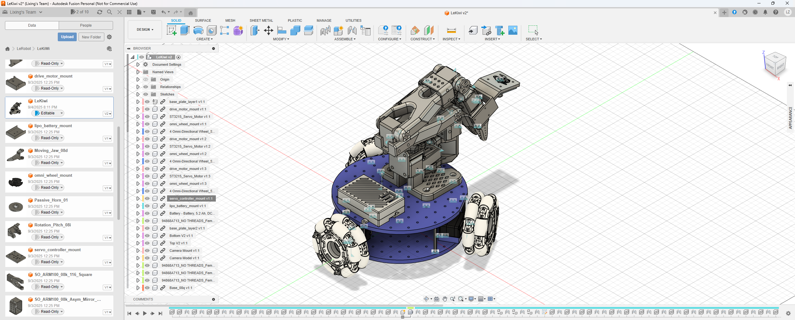

# Build Up the [LeKiWi](https://huggingface.co/docs/lerobot/en/lekiwi)

[← Back to Previous Page](../../../pages/project_LeRobot.html)

## Overview
The LeKiWi is a mobile manipulator robot platform developed by [LeRobot](https://huggingface.co/docs/lerobot/en/lekiwi). It consists of a mobile base and a 6-DoF robotic arm, the [SO101](https://huggingface.co/docs/lerobot/en/so101).

### Works done so far
- The LeRobot follower arm has been built and tested. [details](./250817_Set_Up_the_Follower_Arm.md)
- The LeRobot leader-follower control system has been implemented and tested. [details](./250824_Wired_Leader_Follower_Control.md)

### Objectives
- Build up the LeKiWi robot platform. 
    - It should be able to move.
    - The video stream from both cameras mounted on the base and the endeffector should be accessible.

## Details
### Hardware Setup
- **The 3D model of the LeKiWi setup:**

    [The official CAD files for LeKiWi](https://a360.co/4k1P8yO) is constructed in [Fusion 360](https://www.autodesk.com/products/fusion-360/overview).

    
- **Bill of Materials (BOM) and 3D-Printing Parts:**
    - [LeKiWi BOM](https://github.com/SIGRobotics-UIUC/LeKiwi/blob/main/BOM.md)
    - [3D-Printing Parts](https://github.com/SIGRobotics-UIUC/LeKiwi/blob/main/3DPrinting.md)

- **Overview of the hardware components used in the LeKiWi setup:**
    1. The Follower Arm, built up and tested according to the official tutorial. TODO_Pic
    2. The Leader Arm. TODO_Pic
    3. The Raspberry Pi and necessary accessories. TODO_Pic
    4. 2 cameras. TODO_Pic
    5. The extra parts for the LeKiWi base. TODO_Pic
        - The distance column is 3D-printed. TODO_Pic