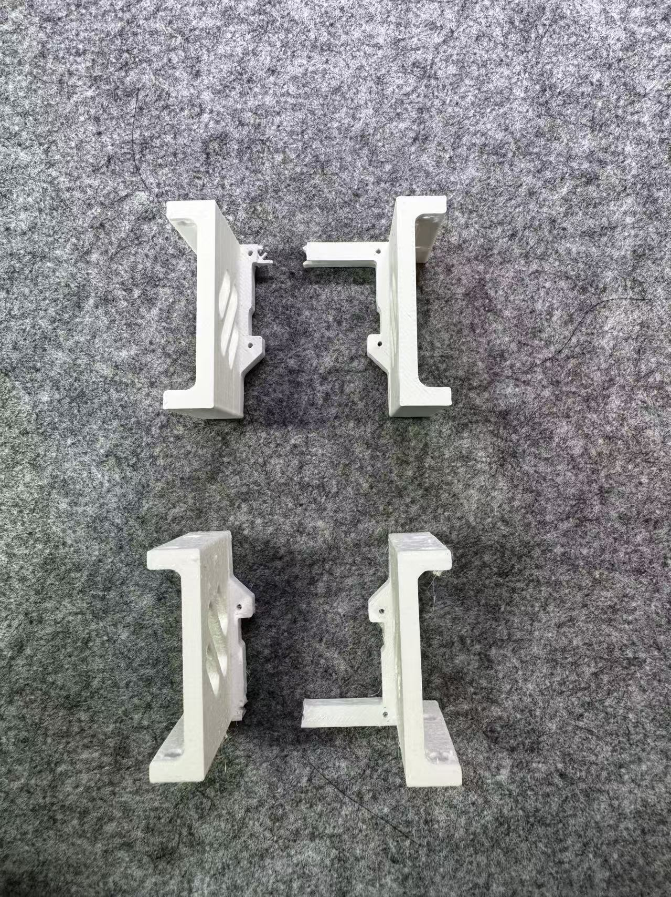
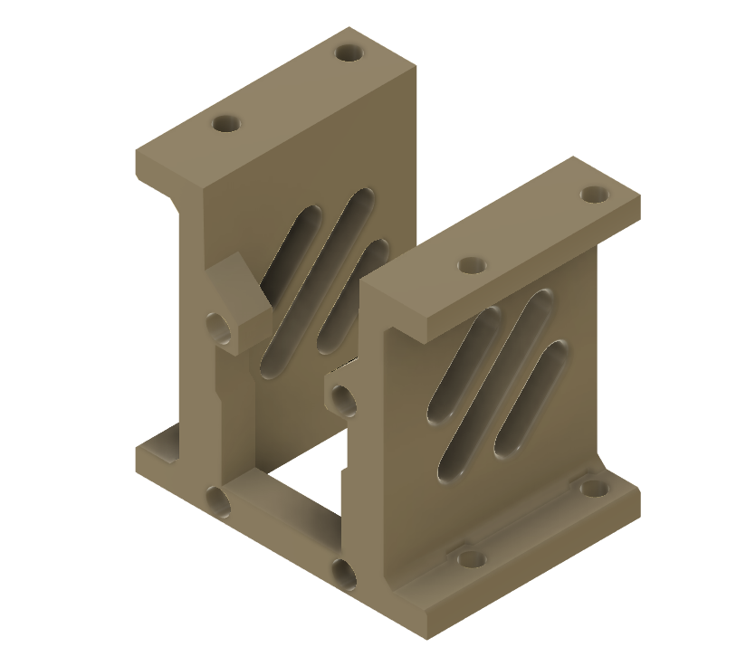
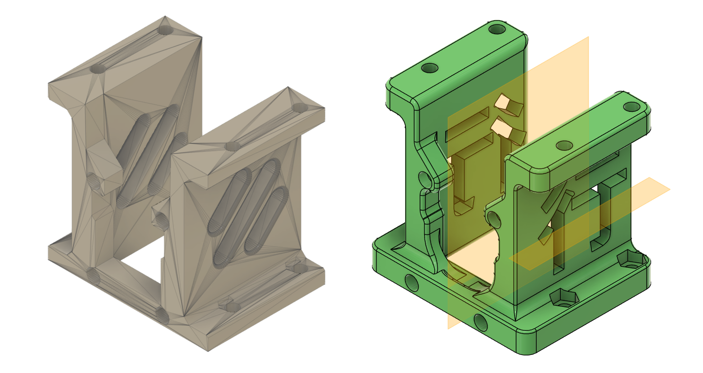
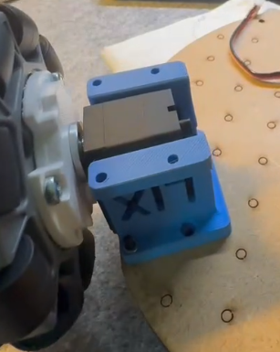

# Redesign the Motor Mount
[← Back to Previous Page](../pages/project_LeRobot.html)

## Overview
### Motivation
The old motor mount from [LeKiWi](https://github.com/SIGRobotics-UIUC/LeKiwi) has following mechanical shortcomings:
1. The mechanical structure at which the bolts are fixed is too thin, which may lead to breakage under stress. It actually happend twice from my side:

2. The structure lacks Fillets and chamfers, which may lead to stress concentration and breakage.

### Objective
The objective is to redesign the motor mount to address the identified shortcomings.

## Details
### CAD Preparation
The original motor mount CAD model is obtained from the LeKiWi project repository on GitHub: [LeKiWi GitHub Repository](https://a360.co/44YAcMn)

### CAD Redesign
The motor mount is redesigned using Fusion 360, obtainable here: [Redesigned Motor Mount](https://a360.co/4nwjjQ8)

### Results
The new motor mount is proven to be strong enough to withstand the stress during operation, and no breakage has been observed so far.

