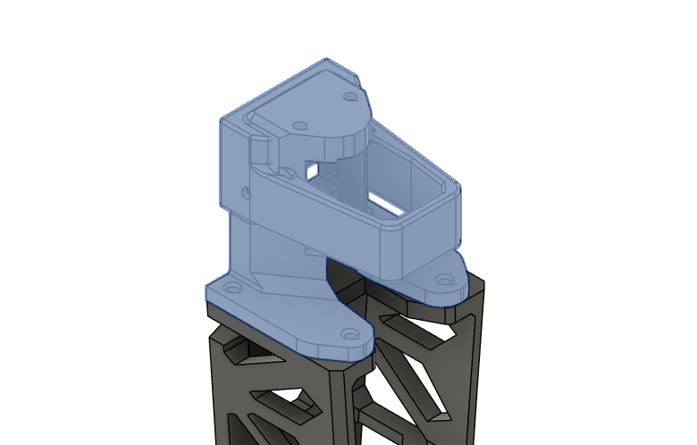
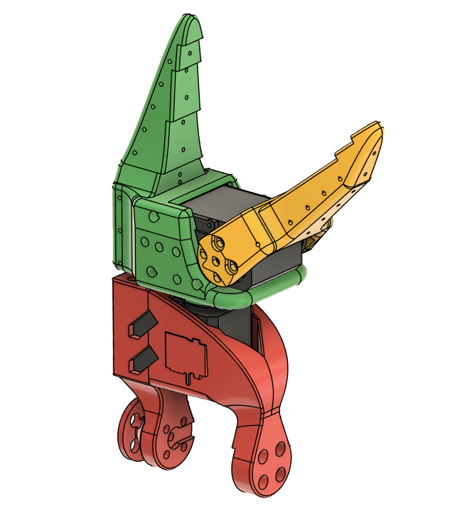
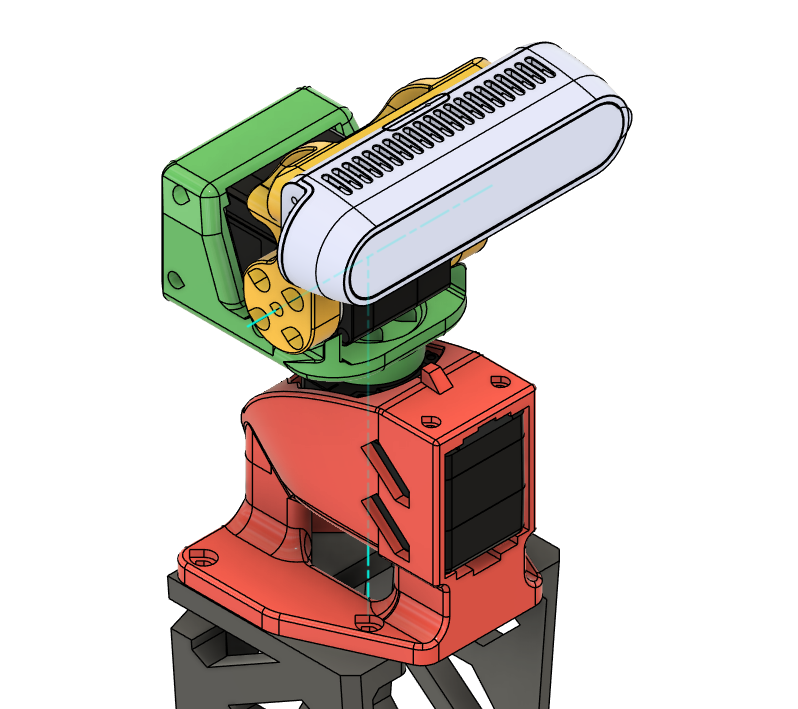
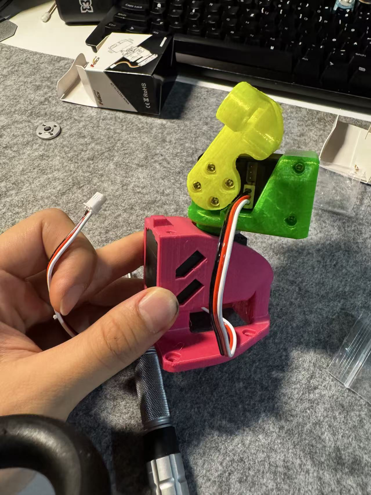

# Redesign the RGBD Gimbal for the XLeRobot
[← Back to Previous Page](../pages/project_LeRobot.html)

## Overview
### Motivation
The old design of the RGBD gimbal for the XLeRobot was a direct copy of the SO101 base mount. It had several issues:
- The Shoulder Pan is supposed to carry the weight of the whole robot arm, which resulted in a stout design. This is in the case of a single camera excessively unnecessary. The structure shall thus be simplified.
- The shoulder pan's rotation angle is constrained between around [-120°, 120°]. We are, however, expecting a 360° panorama sight from the gimble.
- The gimble tower would look better when it stays vertically straight.

### Objective
New gimbal should fulfill following kinematic requirements:
1. Shoulder Pan: near 360° rotation, with a position constraint to avoid cable entanglement.
2. The axises of the Shoulder Tilt and the Elbow Tilt should intersect with each other.
3. The structure should be straight and elegant, so that the gimbal doesn't have the unnecessary "bend".

## Details
### CAD Preparation
The last 2 joints of the SO101 follower are providing the expected Shoulder Tilt and the Elbow Tilt. The first step is to extract these two parts from the SO101 assembly, and prepare them for the new design.

### CAD Redesign
I have then redesigned the gimbal structure in Fusion360. Alterations include:
- The original Wrist Roll Pitch (the red part) is trimmed to be adapted to the neck tower.
- The Wrist Roll and Moving Jaw (the green and yellow parts) are modified to hold the Intel RealSense D435 camera.
- Between the Shoulder Pan and the Shoulder Tilt, a small protrusion is added to avoid the 360° rotation of the Shoulder Pan. This is to avoid cable entanglement.

### Results
The parts are 3D printed and assembled. The results are satisfying.

### Next Steps
Assemble the gimbal with the XLeRobot and test its performance.